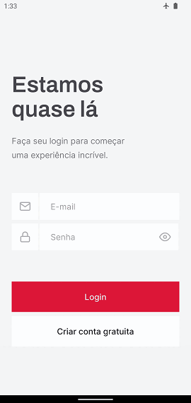

<h1 align="center">
  
</h1>


## 💻 Sobre o projeto

Projeto de um aplicativo mobile para realizar o agendamento do aluguel de veículos, com foco no offline-first, desenvolvido durante o **Ignite de ReactJS** oferecida pela [Rocketseat](https://www.rocketseat.com.br/ignite/).

---

## ⚙️ Funcionalidades

- [x] Realizar novos agendamentos;
- [x] Listagem dos agendamentos anteriores;
- [x] Arquitetura Offline first;
- [x] Login e cadastro de usuários;
- [x] Alteração de dados cadastrais.

---

## 🎨 Layout



---

## 🚀 Como executar o projeto

### Pré-requisitos

Antes de começar, você vai precisar ter instalado em sua máquina as seguintes ferramentas:
[Git](https://git-scm.com), [Node.js](https://nodejs.org/en/).
Além disto é bom ter um editor para trabalhar com o código como [VSCode](https://code.visualstudio.com/)

#### 🧭 Rodando a aplicação web (Frontend)

```bash
# Clone este repositório
$ git clone git@github.com:PedroZago/react-native-ignite-rentx.git
# Acesse a pasta do projeto no seu terminal/cmd
$ cd rentx
# Instale as dependências
$ yarn install
# Inicia um servidor do packager Metro
$ yarn start
# Abre o emulador e executa a aplicação
$ yarn android "or ios"
```

#### 🧭 Rodando a API (Back)

A API está disponível no repositório do incrível professor do curso de React Native da Rockeseat [Rodrigo Gonçalves](https://github.com/rodrigorgtic).

Repositório: [rentx-ignite](https://github.com/rodrigorgtic/rentx-ignite).

---

## 🛠 Tecnologias

As seguintes ferramentas foram usadas na construção do projeto:

#### **Website** ([React Native](https://reactnative.dev/) + [TypeScript](https://www.typescriptlang.org/))

- **[Expo](https://expo.dev/)**
- **[Axios](https://axios-http.com/)**
- **[date-fns](https://date-fns.org/)**
- **[styled-components](https://www.styled-components.com/)**
- **[Lottie RN](https://github.com/lottie-react-native/lottie-react-native)**
- **[React Navigation](https://reactnavigation.org/)**
- **[React Native Calendars](https://github.com/wix/react-native-calendars)**
- **[React Native Reanimated](https://docs.swmansion.com/react-native-reanimated/)**
- **[Babel](https://babeljs.io/)**
- **[Metro](https://facebook.github.io/metro/)**

---

## 📝 Licença

Este projeto esta sobe a licença [MIT](./LICENSE).
